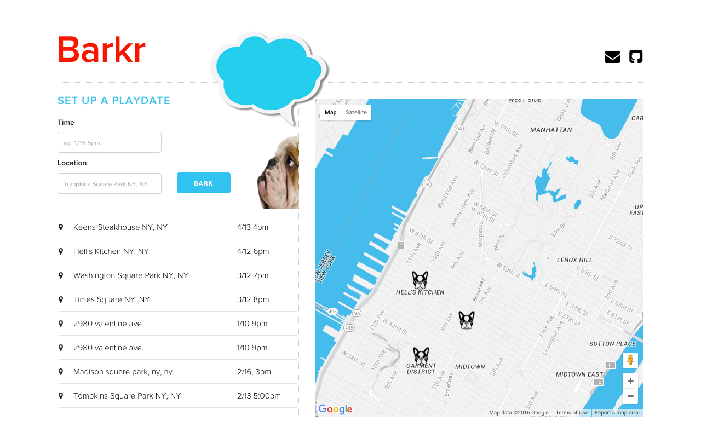
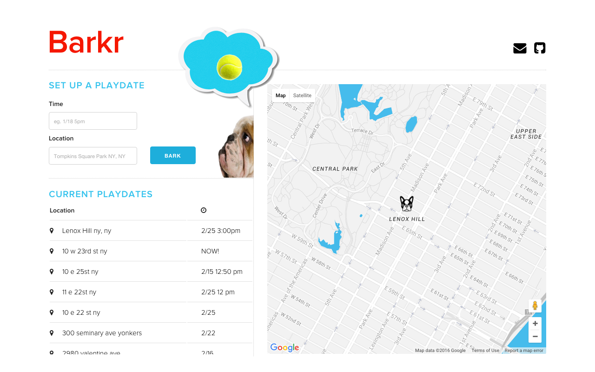
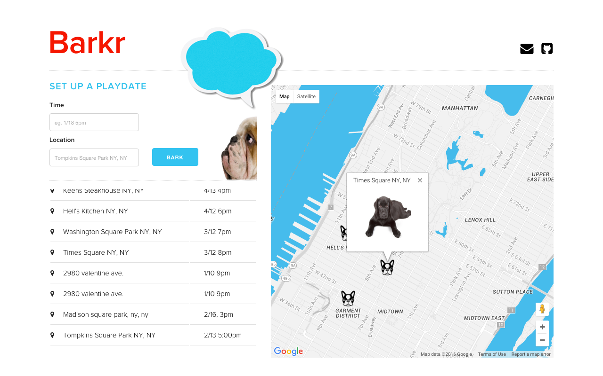

### Barkr

Set up a puppy playdate or find one in your area.

---

### Development Approach

Can't get enough puppies in your life? How about an app that'll help you find the closest puppy playdate or help you set up one. Using the MEAN stack and google maps API I created an app for dog aficionados to congregate and share their love for man's best friend.

---

### User Cases

* When a user inputs a time and location for a playdate, it recenters the location on the map and places a custom marker.

* A user may also click on a marker, which prompts an infowindow with an image of a puppy.

---

### URL

[Barkr](https://barkrapp.herokuapp.com/)

---

### Technologies

* Google Maps API
* [The Puppy API](http://www.thepuppyapi.com/)
* MongoDB
* Express
* Angular
* NodeJS
* JavaScript
* jQuery
* Skeleton 

---

### Upcoming Versions
TBD...
